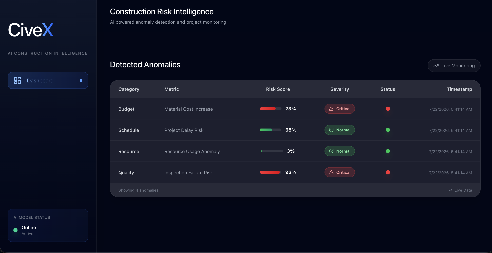
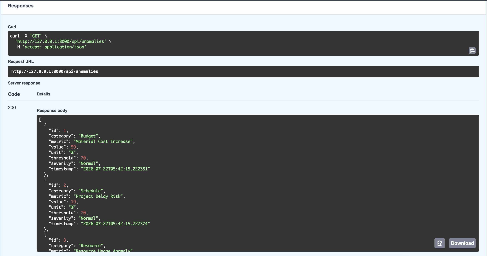

# CiveX Anomaly Dashboard

A full-stack anomaly monitoring dashboard built as a technical evaluation project.

This application simulates a construction intelligence platform where the backend generates random numerical deviation data and the frontend visualizes risk levels through a monitoring dashboard.

The goal of this project is to demonstrate full-stack development skills, including API development, frontend integration, data visualization, and software architecture.

---
# Dashboard Preview

## Dashboard

<p align="center">
    
</p>

## API Documentation

<p align="center">
    
</p>

---
# Features

- FastAPI backend API
- React frontend dashboard
- Random anomaly data generation
- Real-time data refresh simulation
- Risk severity classification
- Critical value highlighting
- Responsive dashboard interface
- Data visualization
- Construction-related anomaly metrics

---

# Tech Stack

## Backend

- Python
- FastAPI
- Uvicorn
- Pydantic

## Frontend

- React
- Vite
- Tailwind CSS
- Axios
- Recharts
- Lucide React

---

# Project Structure

```
civex-anomaly-dashboard/

├── backend/
│   ├── main.py
│   ├── requirements.txt
│   └── README.md
│
├── frontend/
│   ├── src/
│   │   ├── components/
│   │   ├── pages/
│   │   └── services/
│   │
│   ├── package.json
│   └── README.md
│
└── README.md
```

---

# Application Overview

The application consists of two main parts:

## Backend

The FastAPI backend provides an API endpoint that generates simulated construction anomaly data.

Endpoint:

```
GET /api/anomalies
```

Each request generates new random deviation values.

Example response:

```json
[
  {
    "id": 1,
    "category": "Budget",
    "metric": "Material Cost Increase",
    "value": 82,
    "unit": "%",
    "threshold": 70,
    "severity": "Critical",
    "timestamp": "2026-07-21T18:00:00"
  }
]
```

---

## Frontend

The React dashboard consumes the API and displays anomaly information.

The dashboard provides:

- Risk overview
- Anomaly table
- Critical alerts
- Visual indicators
- Automatic data updates

Critical values are highlighted when the deviation exceeds the defined threshold.

---

# Backend Setup

Navigate to the backend folder:

```bash
cd backend
```

Create a virtual environment:

```bash
python -m venv .venv
```

Activate the environment.

### macOS/Linux:

```bash
source .venv/bin/activate
```

### Windows:

```bash
.venv\Scripts\activate
```

Install dependencies:

```bash
pip install -r requirements.txt
```

Start the FastAPI server:

```bash
uvicorn main:app --reload
```

Backend runs on:

```
http://127.0.0.1:8000
```

API documentation:

```
http://127.0.0.1:8000/docs
```

---

# Frontend Setup

Navigate to the frontend folder:

```bash
cd frontend
```

Install dependencies:

```bash
npm install
```

Run development server:

```bash
npm run dev
```

Frontend runs on:

```
http://localhost:5173
```

---

# API Documentation

## Get Anomaly Data

Request:

```
GET /api/anomalies
```

Response fields:

| Field | Description |
|---|---|
| id | Unique anomaly identifier |
| category | Risk category |
| metric | Metric being monitored |
| value | Numerical deviation value |
| unit | Measurement unit |
| threshold | Critical detection threshold |
| severity | Risk classification |
| timestamp | Generated timestamp |

---

# Anomaly Detection Logic

The application uses threshold-based anomaly classification.

Detection rule:

```
if value >= 70:
    severity = Critical
else:
    severity = Normal
```

Example:

```
Material Cost Increase: 85%

Result:
Critical
```

---

# Data Flow

```
React Dashboard
        |
        |
        | HTTP Request
        |
        ↓
FastAPI Backend
        |
        |
        | Generate Random Data
        |
        ↓
Anomaly Response
        |
        |
        ↓
Dashboard Visualization
```

---

# Automatic Data Refresh

The frontend periodically requests new data from the backend.

This simulates a live monitoring environment where construction metrics are continuously updated.

Example flow:

```
Every 10 seconds:

Frontend
   |
   ↓
GET /api/anomalies

Backend generates new values

   |
   ↓

Dashboard updates
```


# Author

Hsu Myat Win

Full-Stack Developer
